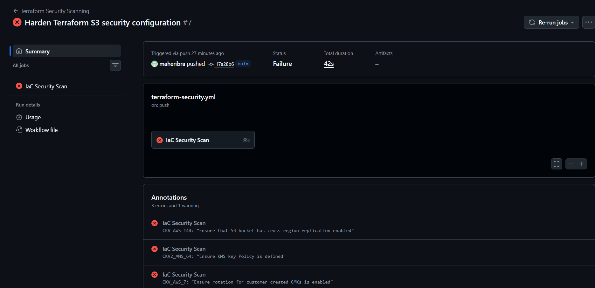
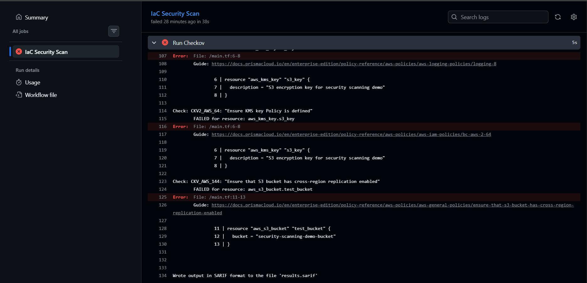
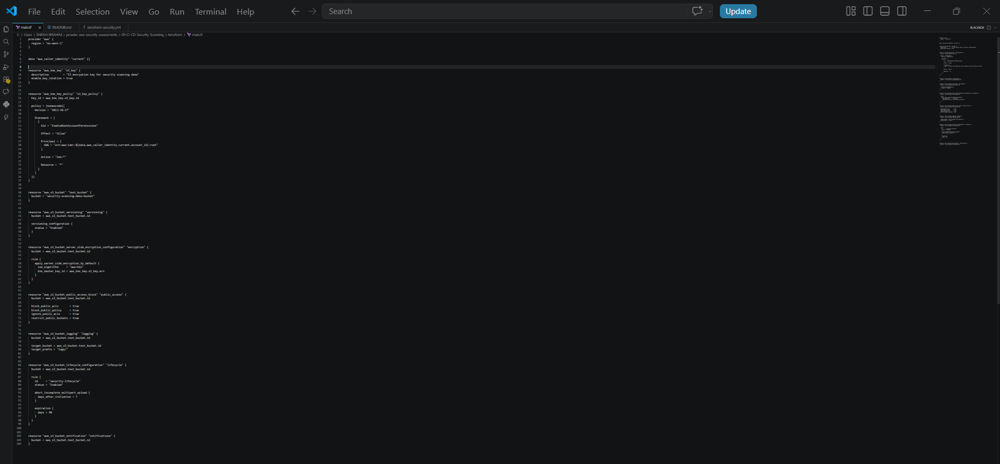
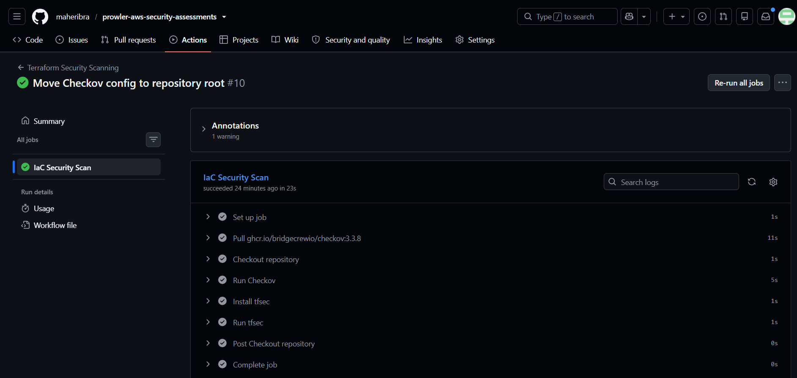

# CI/CD Security Scanning with GitHub Actions, Checkov and tfsec

## Overview

This project demonstrates an automated Infrastructure-as-Code (IaC) security scanning pipeline using GitHub Actions.

Terraform configurations are automatically scanned on every push and pull request to identify cloud security risks before infrastructure deployment.

The pipeline uses:

- Checkov for Terraform security and compliance scanning
- tfsec for Terraform vulnerability analysis
- GitHub Actions for CI/CD automation

---

## Objectives

- Implement DevSecOps security practices
- Automate Terraform security checks
- Detect insecure cloud configurations before deployment
- Apply security hardening based on scan results
- Integrate security testing into the development lifecycle

---

## Project Structure

```
prowler-aws-security-assessments/
│
├── .github/
│   └── workflows/
│       └── terraform-security.yml
│
└── 09-CI-CD-Security-Scanning/
    │
    ├── screenshots/
│   ├── 01-github-actions-failed-scan.png
│   ├── 02-checkov-findings.png
│   ├── 03-terraform-hardening.png
│   └── 04-github-actions-passed-scan.png
│
├── terraform/
│   └── main.tf
│
├── README.md
└── .checkov.yaml
```

---

## Tools Used

| Tool | Purpose |
|---|---|
| GitHub Actions | CI/CD automation platform |
| Checkov | Infrastructure-as-Code security scanner |
| tfsec | Terraform security scanner |
| Terraform | Cloud infrastructure provisioning language |
| AWS S3 | Example cloud resource scanned |

---

# CI/CD Pipeline Workflow

The GitHub Actions workflow automatically runs when:

- Code is pushed to the main branch
- A pull request is created

Pipeline steps:

1. Checkout repository
2. Run Checkov security scan
3. Install tfsec
4. Run tfsec Terraform scan
5. Report security issues

Workflow file:

```
../../.github/workflows/terraform-security.yml
```

The GitHub Actions workflow is stored at the repository root because GitHub only detects workflows from the root `.github/workflows` directory.

---

# Initial Security Scan Results

The first Terraform scan intentionally contained insecure configurations to demonstrate security detection.

## Checkov Findings

Initial scan identified:

- S3 bucket versioning disabled
- Missing encryption
- Public access controls not enforced
- Missing lifecycle configuration
- Missing access logging
- Missing event notifications
- Missing public ACL restrictions

Total initial findings:

```
10 security issues detected
```

---

# Security Remediation Applied

The Terraform configuration was hardened by implementing:

## S3 Versioning

Enabled versioning to protect against accidental deletion and data corruption.

## Encryption

Implemented AWS KMS encryption for S3 objects.

Security improvement:

- Customer managed encryption key
- Automatic key rotation enabled

## Public Access Protection

Enabled:

- Block public ACLs
- Block public bucket policies
- Ignore public ACLs
- Restrict public buckets

## Logging

Enabled S3 access logging configuration.

## Lifecycle Management

Added lifecycle rules including:

- Object expiration
- Abort incomplete multipart uploads

## KMS Security Controls

Implemented:

- KMS key rotation
- KMS key policy

---

# Checkov Exception

One Checkov requirement was excluded:

```
CKV_AWS_144
```

Reason:

Cross-region replication is a disaster recovery/business continuity requirement and depends on application availability requirements.

For this security scanning demonstration, the project focuses on:

- Encryption
- Access control
- Data protection
- Security monitoring
- Secure Terraform practices

The exception is documented using:

```
.checkov.yaml
```

---

# Final Pipeline Result

After remediation:

```
Terraform Security Scanning

PASS

Checkov: Passed
tfsec: Passed
```

The pipeline successfully validates Terraform security before infrastructure deployment.

---

# Security Benefits Demonstrated

This project demonstrates practical DevSecOps capabilities:

- Automated security testing
- Infrastructure-as-Code scanning
- Cloud security validation
- Secure Terraform development
- Continuous security monitoring
- Shift-left security practices

---

# Future Improvements

Possible enhancements:

- Add Terraform plan security checks
- Store scan reports as GitHub Actions artifacts
- Add AWS Security Hub integration
- Add automated remediation workflows
- Add container security scanning
- Add secrets scanning with GitHub Advanced Security

---

## Conclusion

This project demonstrates how cloud security controls can be integrated directly into CI/CD pipelines.

By scanning Terraform code before deployment, security issues can be identified and remediated early in the development lifecycle.

## Screenshots

### Initial Security Scan



### Checkov Findings



### Terraform Security Hardening



### Final CI/CD Security Pipeline

