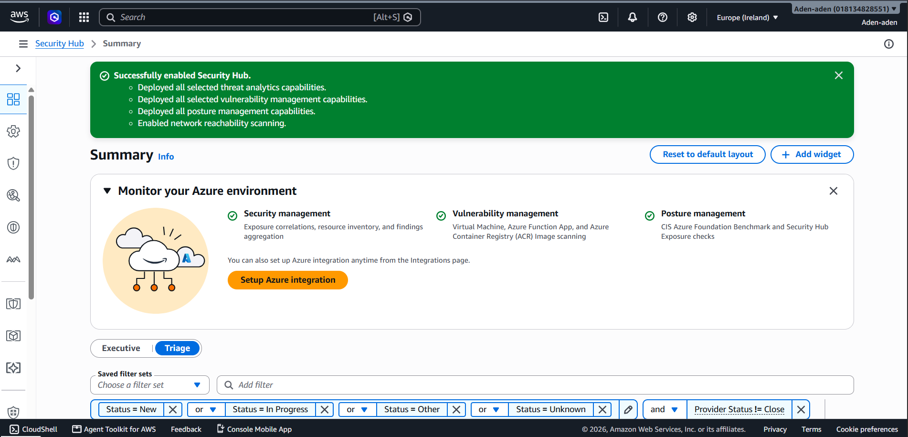
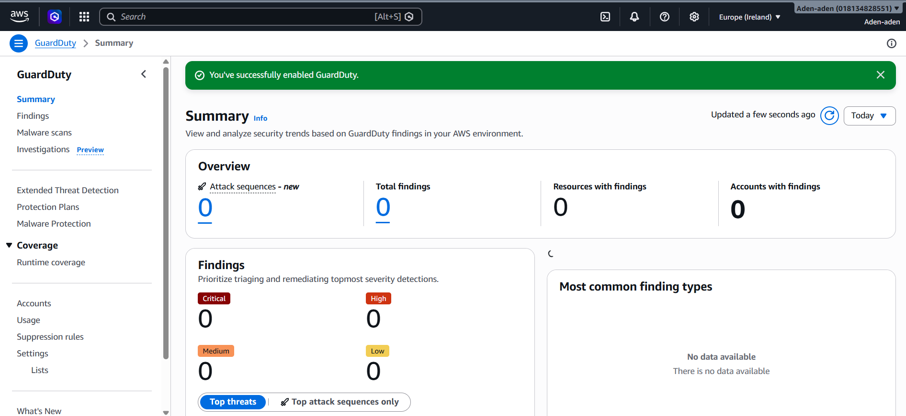
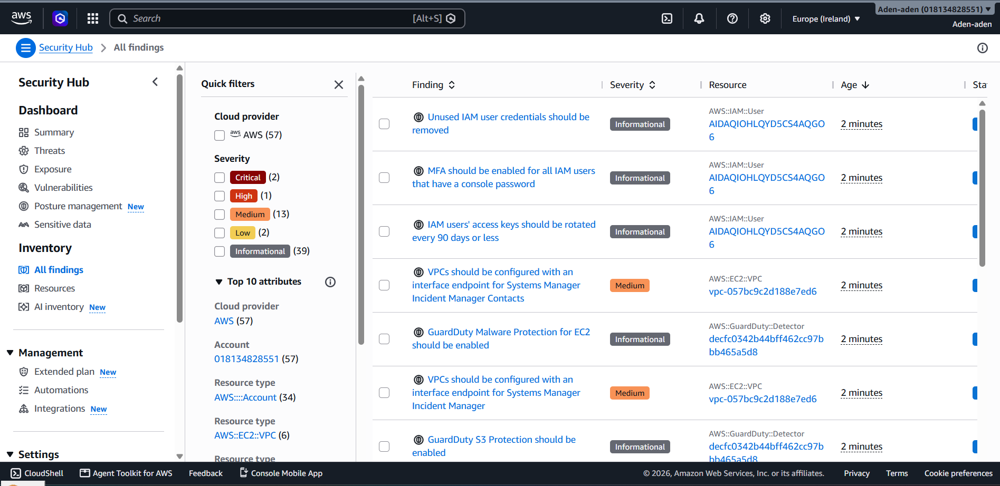

# AWS Security Hub + GuardDuty Integration

## Overview

This project demonstrates the integration of **AWS Security Hub** and **Amazon GuardDuty** to provide centralized security monitoring, threat detection, and security findings across an AWS environment.

The project combines:

* AWS Security Hub
* Amazon GuardDuty
* Security Hub findings
* GuardDuty threat detection
* Security findings analysis
* Security monitoring and visibility

The goal is to demonstrate practical cloud security monitoring and threat detection using native AWS security services.

---

## Objectives

* Enable AWS Security Hub.
* Enable Amazon GuardDuty.
* Configure Security Hub security capabilities.
* Integrate GuardDuty threat detection with Security Hub.
* Review centralized security findings.
* Identify security findings by severity.
* Export Security Hub findings.
* Export GuardDuty findings.
* Document security findings and recommended remediation.

---

## Architecture

```text
AWS Account
    |
    +--------------------+
    |                    |
    v                    v
Amazon GuardDuty    AWS Security Hub
    |                    |
    | Threat Detection   | Centralized Findings
    |                    |
    +---------+----------+
              |
              v
       Security Findings
              |
              v
       Analysis & Remediation
```

---

## Environment

* Cloud Provider: AWS
* AWS Region: Europe (Ireland)
* Security Hub: Enabled
* GuardDuty: Enabled
* Security Hub Findings: 57
* GuardDuty Findings: 2
* Assessment Type: Cloud Security Monitoring and Threat Detection

---

## Security Hub Configuration

AWS Security Hub was enabled with the available security capabilities.

The configuration provides centralized security visibility and security findings across the AWS environment.

Security Hub capabilities used include:

* Security management
* Findings aggregation
* Resource inventory
* Security Hub CSPM
* Threat analytics
* GuardDuty integration
* Security monitoring

---

## GuardDuty Configuration

Amazon GuardDuty was enabled to provide continuous threat detection and security monitoring.

GuardDuty analyzes AWS account activity and security telemetry to identify potentially malicious or suspicious behavior.

The GuardDuty detector was successfully identified and queried using the AWS CLI.

---

## Findings Summary

At the time of the assessment, AWS Security Hub reported:

| Severity      | Findings |
| ------------- | -------: |
| Critical      |        2 |
| High          |        1 |
| Medium        |       13 |
| Low           |        2 |
| Informational |       39 |
| **Total**     |   **57** |

Amazon GuardDuty reported:

* GuardDuty findings: 2

The findings were exported for further analysis and documentation.

Detailed findings and recommended remediation actions are documented in:

* `findings.md`
* `remediation.md`

---

## Evidence

Screenshots are stored in the `screenshots/` directory.

### Security Hub Enabled



### GuardDuty Enabled



### Security Findings



---

## Exported Security Data

The `reports/` directory contains exported security findings:

```text
reports/
├── securityhub-findings.json
├── guardduty-findings.json
└── guardduty-details.json
```

### Security Hub Findings

`securityhub-findings.json` contains findings retrieved from AWS Security Hub using the AWS CLI.

### GuardDuty Findings

`guardduty-findings.json` contains GuardDuty finding identifiers retrieved using the AWS CLI.

### GuardDuty Finding Details

`guardduty-details.json` contains detailed information about the identified GuardDuty findings.

---

## AWS CLI Commands Used

### List GuardDuty Detectors

```bash
aws guardduty list-detectors
```

### List GuardDuty Findings

```bash
aws guardduty list-findings \
--detector-id YOUR_DETECTOR_ID
```

### Export GuardDuty Finding IDs

```bash
aws guardduty list-findings \
--detector-id YOUR_DETECTOR_ID \
> guardduty-findings.json
```

### Retrieve GuardDuty Finding Details

```bash
aws guardduty get-findings \
--detector-id YOUR_DETECTOR_ID \
--finding-ids FINDING_ID_1 FINDING_ID_2 \
> guardduty-details.json
```

### Export Security Hub Findings

```bash
aws securityhub get-findings \
> securityhub-findings.json
```

---

## Security Analysis

The assessment demonstrates how AWS-native security services can be combined to improve cloud security visibility.

AWS Security Hub provides centralized security findings and security posture visibility, while GuardDuty provides continuous threat detection.

The integration allows security teams to:

* Centralize security findings.
* Identify potentially malicious activity.
* Prioritize findings by severity.
* Monitor AWS resources.
* Investigate security alerts.
* Support incident response.
* Track security posture over time.

---

## Remediation

Findings identified during the assessment should be reviewed and prioritized based on severity and business impact.

Recommended remediation actions include:

1. Investigate all Critical and High severity findings.
2. Review affected AWS resources.
3. Determine whether findings are genuine security risks or false positives.
4. Apply appropriate security controls.
5. Re-run Security Hub assessments.
6. Review GuardDuty findings after remediation.
7. Confirm that resolved findings are closed.
8. Continue monitoring for new security events.

Detailed remediation guidance is available in:

```text
remediation.md
```

---

## Project Structure

```text
10-Security-Hub-GuardDuty/
│
├── screenshots/
│   ├── guardduty-enabled.png
│   ├── securityhub-enabled.png
│   └── findings.png
│
├── reports/
│   ├── securityhub-findings.json
│   ├── guardduty-findings.json
│   └── guardduty-details.json
│
├── README.md
├── findings.md
└── remediation.md
```

---

## Skills Demonstrated

* AWS Security Hub
* Amazon GuardDuty
* AWS Security Monitoring
* Cloud Threat Detection
* Security Findings Analysis
* AWS CLI
* Cloud Security Posture Management
* Security Operations
* Security Incident Investigation
* Security Remediation
* AWS Native Security Services

---

## Conclusion

This project demonstrates the practical deployment and use of AWS Security Hub and Amazon GuardDuty for centralized cloud security monitoring and threat detection.

The assessment successfully enabled AWS security monitoring capabilities, identified security findings, exported findings using the AWS CLI, and documented the findings and recommended remediation actions.

This project forms part of a broader AWS cloud security portfolio demonstrating security assessment, infrastructure hardening, continuous monitoring, and security automation.
